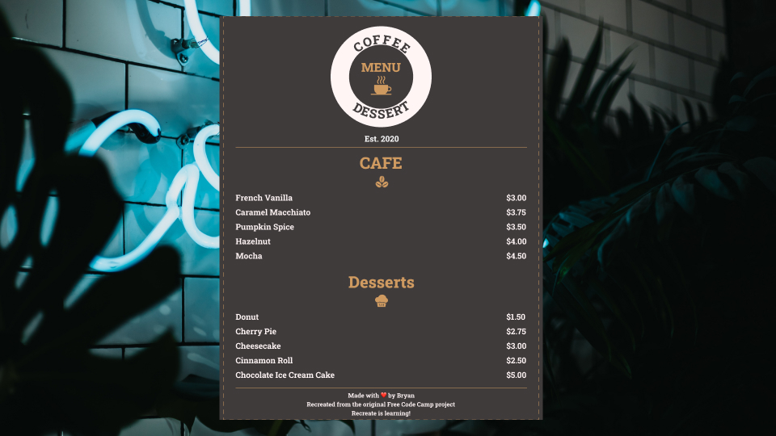
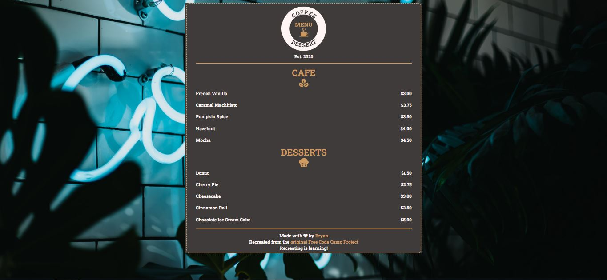

# **MENU DE CAFETERIA**  

|**ENGLISH**|**PT-BR**|
|:---------:|:-------:|
|[HERE](./README.md)|[HERE](./README-PTBR.md)|  

## **IDEIA**  
Este foi o segundo projeto do curso. A ideia era criar um Menu de uma cafeteria para ensinar as bases de HTML e CSS.  

## **PROTÓTIPO**  

  

## **Resultado**  

  

>Screenshot com 67% de zoom.

## **Alterações**  

- Uma div adicional foi colocada dentro da div original para que pudesse estilizar com as bordas tracejadas;
- Criei uma logo simbólica para dar um ar mais legal ao projeto. Essa criação não me tomou muito tempo;
- Alterei a imagem do fundo por uma mais bacana;
- Alterei a cor do fundo do menu, assim como a cor da fonte e das imagens, buscando dar um bom contraste entre os elementos;
- Alterei a cor dos links no footer para cada pseudo-classe buscando dar um bom contraste também;
- Removi a linha abaixo dos links no footer;
- Alterei os ícones por uns mais bonitos;
- Alterei o texto do footer para algo meu;
- Adicionei o link do meu LinkHub no footer, assim como o link para o projeto original do Free Code Camp;
- Criei uma animação simples de entrada do menu na tela;
- Adicionei um efeito *"scale"* e mudei o cursor do mouse para *"pointer"* para que aumente um pouco o item do cardápio quando o usuário deixa o mouse em cima do item;
- No código do CSS, utilizei um *reset* simples em *margin*, *padding* e adicionei um `box-sizing: border-box;` para que o tamanho dos elementos já inclua os valores de *margin* e *padding* no cálculo;
- Atribui em todo o documento a fonte escolhida (Roboto Slab), assim como coloquei `font-size: 62.5%` para todo o HTML. Fiz isso para definir a fonte com o tamanho de 10px, visto que os navegadores originalmente trabalham com 16px de tamanho de fonte. Essa alteração facilita o trabalho com a unidade de medida CSS *"rem"*, uma unidade relativa muito utilizada, visto que auxilia muito no controle da responsividade.   

## **RECURSOS**  
Os recursos a seguir foram utilizados neste projeto.  

|**RECURSO**|**LINK**|**AUTOR**|
|:---------:|:------:|:------:|
|Ícone sementes de café |[Sementes](https://www.onlinewebfonts.com/icon/479228)|Online Web Fonts|
|Ícone sobremesa|[Sobremesa](https://www.svgrepo.com/svg/171835/cupcake-dessert)|SVG Repo|
|Ícone Café|[Café](https://www.svgrepo.com/svg/176078/hot-coffee)|SVG Repo|
|Imagem do background|[BG](https://unsplash.com/photos/PQZnHyDd9Dc)|Devin Avery - Unsplash|
|Fonte Roboto Slab|[Fonte](https://fonts.google.com/specimen/Roboto+Slab?query=roboto+slab)|Christian Robertson - Google Fonts|