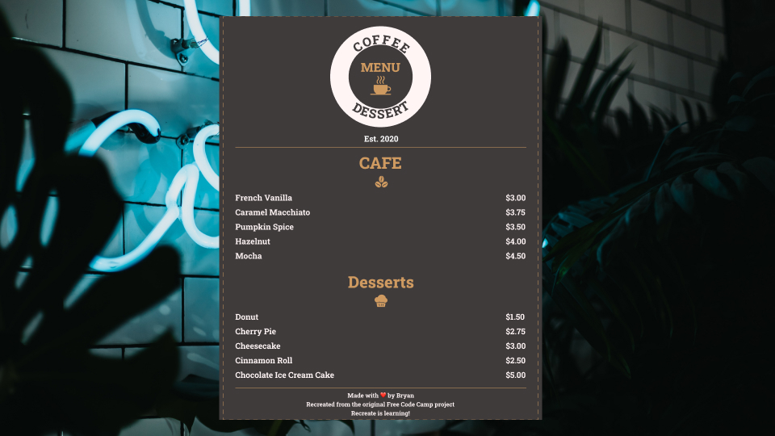
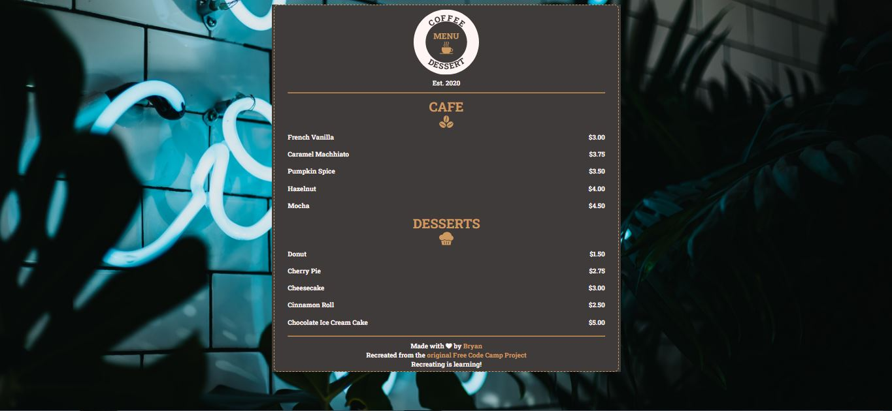

# **CAFE MENU**  

|**ENGLISH**|**PT-BR**|
|:---------:|:-------:|
|[HERE](./README.md)|[HERE](./README-PTBR.md)|  

## **IDEA**  
This was the second project of the course. The idea was to create a Menu for a coffee shop to teach the HTML and CSS foundations.  

## **PROTOTYPE**  

  

## **Result**  

  

>Screenshot with 67% zoom.

## **Changes**  

- An additional div was placed inside the original div so that it could style with the dashed edges;
- I designed a symbolic logo to give the project a cooler look. This creation did not take me much time;
- I changed the background image to a prettier one;
- I changed the background color of the menu, as well as the color of the font and images, trying to give a good contrast between the elements;
- I changed the color of the links in the footer for each pseudo-class trying to give a good contrast as well;
- Removed the line below the links in the footer;
- Changed the icons to prettier ones;
- Changed the footer text to something of my own;
- I have added my LinkHub link in the footer, as well as the link to the original Free Code Camp project;
- I created a simple menu entry animation on the screen;
- I have added a "scale" effect and changed the mouse cursor to "pointer" to make the menu item slightly larger when the user leaves the mouse on top of the item;
- In the CSS code I used a simple reset on "margin", "padding" and added a `box-sizing: border-box;` in order to make the size of the elements already include the "margin" and "padding" values in the calculation;
- I assigned the chosen font (Roboto Slab) throughout the document, as well as putting `font-size: 62.5%` for all HTML. I did this to set the font size to 10px, since browsers originally work with a 16px font size. This change makes it easier to work with the CSS unit of measurement *"rem "*, a relative unity widely used, since it helps a lot in controlling responsiveness. 

## **RESOURCES**  
The following resources were used in this project.  

|**Resource**|**LINK**|**AUTHOR**|
|:----------:|:------:|:--------:|
|Coffee seeds icon |[Seeds](https://www.onlinewebfonts.com/icon/479228)|Online Web Fonts|
|Dessert icon|[Dessert](https://www.svgrepo.com/svg/171835/cupcake-dessert)|SVG Repo|
|Coffee icon|[Coffee](https://www.svgrepo.com/svg/176078/hot-coffee)|SVG Repo|
|Background image|[BG](https://unsplash.com/photos/PQZnHyDd9Dc)|Devin Avery - Unsplash|
|Roboto Slab Font|[Font](https://fonts.google.com/specimen/Roboto+Slab?query=roboto+slab)|Christian Robertson - Google Fonts|